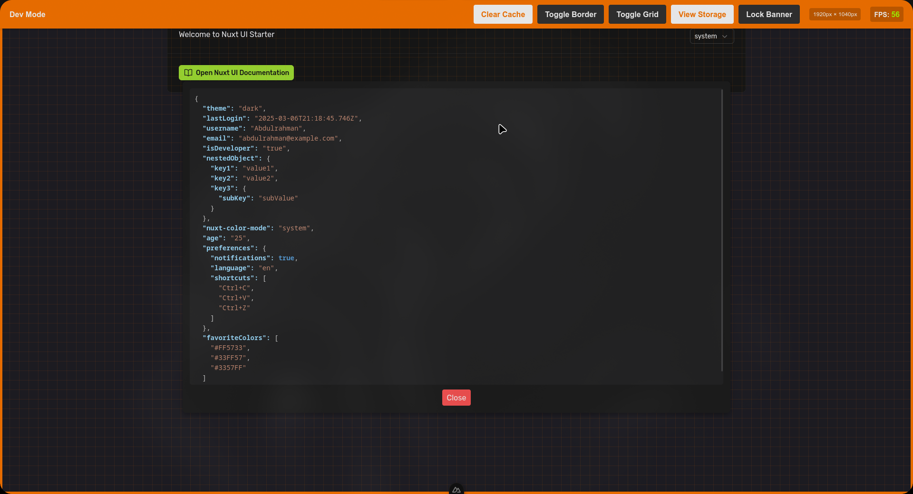

# DevMode Extension

A simple Firefox extension designed for developers working on localhost environments. It adds a developer toolbar with helpful features like a viewport border, grid overlay, FPS counter, and local storage viewer.



## Features
- **Viewport Border**: Adds a border around the viewport to differentiate between dev tabs and non-dev tabs.
- **Grid Overlay**: Display a grid overlay for alignment.
- **FPS Counter**: Shows real-time FPS with color changes (green to red) based on performance.
- **Local Storage Viewer**: View local storage data in a formatted JSON view.

## Installation
1. Clone or download the repository.
2. Run the extension using `bun` (or `npm`):
   ```bash
   bun run start
   ```
3. Alternatively, build it and install:
   ```bash
   bun run build
   ```
Then install the extension by following these steps:
1. Open Firefox and navigate to `about:debugging`.
2. Click on `This Firefox` in the sidebar.
3. Click on `Load Temporary Add-on...` and select the `.zip` archive in the `web-ext-artifacts` folder.

## Usage
Once installed, the toolbar will appear at the top of the page _(on hover)_ on `localhost` or `127.0.0.1`. Use the buttons to toggle the features.

---
For issues, suggestions, or feedback, please create an [issue](https://github.com/d7omdev/devmode/issues) or [pull request](https://github.com/d7omdev/devmode/pulls).


